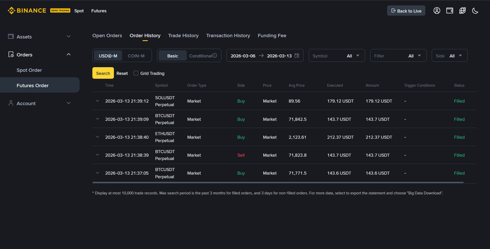

# Binance Futures Testnet Trading Bot CLI

A modular Python CLI application to place MARKET and LIMIT orders on the Binance Futures Testnet (USDT-M).

## Features

- **Place Orders**: Support for BUY/SELL sides and MARKET/LIMIT types.
- **Validation**: Robust CLI input validation.
- **Logging**: Detailed logging of requests, responses, and errors.
- **Testnet Ready**: Pre-configured for Binance Futures Testnet.

## Project Structure

```text
trading_bot/
├── bot/
│   ├── __init__.py
│   ├── client.py        # Binance API client wrapper
│   ├── orders.py        # Order placement logic
│   ├── validators.py    # CLI input validation
│   └── logging_config.py# Centralized logging setup
├── logs/                # Dir for log files
│   └── trading_bot.log
├── cli.py               # CLI entry point
├── README.md
├── requirements.txt
└── .env.example
```

## Setup Instructions

### 1. Prerequisites
- Python 3.8+
- Binance Futures Testnet API Key and Secret. Get them here: [testnet.binancefuture.com](https://testnet.binancefuture.com/)

### 2. Installation
Clone the repository and install dependencies:
```bash
pip install -r requirements.txt
```

### 3. Environment Setup
Create a `.env` file in the root directory (copy from `.env.example`):
```bash
cp .env.example .env
```
Edit `.env` and add your API credentials:
```text
BINANCE_API_KEY=your_testnet_key
BINANCE_SECRET_KEY=your_testnet_secret
```

## Usage

### Run a MARKET Order
```bash
python cli.py --symbol BTCUSDT --side BUY --type MARKET --quantity 0.001
```

### Run a LIMIT Order
```bash
python cli.py --symbol BTCUSDT --side SELL --type LIMIT --quantity 0.001 --price 50000
```

## Logging
Logs are saved to `logs/trading_bot.log` and also printed to the console.
## Requests that are executed on the futures


## Safety Note
This bot is configured for **TESTNET ONLY**. Never use mainnet keys with this configuration without modification.
